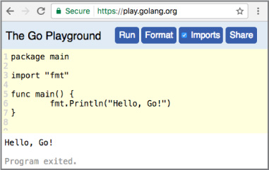
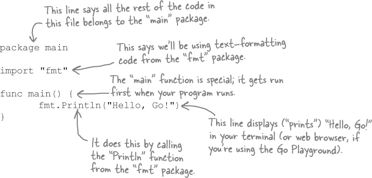
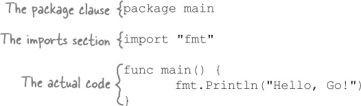

# Chapter 1. let’s get going: Syntax Basics

## Ready, set, Go!

Back in 2007, the search engine Google had a problem. They had to maintain programs with millions of lines of code. Before they could test new changes, they had to compile the code into a runnable form, a process which at the time took the better part of an hour. Needless to say, this was bad for developer productivity.

So Google engineers Robert Griesemer, Rob Pike, and Ken Thompson sketched out some goals for a new language:

- Fast compilation
- Less cumbersome code
- Unused memory freed automatically (garbage collection)
- Easy-to-write software that does several operations simultaneously (concurrency)
- Good support for processors with multiple cores

After a couple years of work, Google had created Go: a language that was fast to write code for and produced programs that were fast to compile and run. The project switched to an open source license in 2009. It’s now free for anyone to use. And you should use it! Go is rapidly gaining popularity thanks to its simplicity and power.

If you’re writing a command-line tool, Go can produce executable files for Windows, macOS, and Linux, all from the same source code. If you’re writing a web server, it can help you handle many users connecting at once. And no matter what you’re writing, it will help you ensure that your code is easier to maintain and add to.

Ready to learn more? Let’s Go!

## The Go Playground

The easiest way to try Go is to visit https://play.golang.org in your web browser. There, the Go team has set up a simple editor where you can enter Go code and run it on their servers. The result is displayed right there in your browser.



(Of course, this only works if you have a stable internet connection. If you don’t, see [“Installing Go on your computer”](https://golang.org/doc/install#install) to learn how to download and run the Go compiler directly on your computer. Then run the following examples using the compiler instead.)

### Let’s try it out now!


1. Open https://play.golang.org in your browser. (Don’t worry if what you see doesn’t quite match the screenshot; it just means they’ve improved the site since this book was printed!)

2. Delete any code that’s in the editing area, and type this instead:

```go
    package main
    import "fmt"
    func main() {
        fmt.Println("Hello, Go!")
    }
```

> NOTE - Don’t worry, we’ll explain what all this means on the next page!

3. Click the Format button, which will automatically reformat your code according to Go conventions.

4. Click the Run button.

You should see “Hello, Go!” displayed at the bottom of the screen. Congratulations, you’ve just run your first Go program!


## What does it all mean?

You’ve just run your first Go program! Now let’s look at the code and figure out what it actually means...

Every Go file starts with a package clause. A **package** is a collection of code that all does similar things, like formatting strings or drawing images. The package clause gives the name of the package that this file’s code will become a part of. In this case, we use the special package main, which is required if this code is going to be run directly (usually from the terminal).

Next, Go files almost always have one or more import statements. Each file needs to **import** other packages before its code can use the code those other packages contain. Loading all the Go code on your computer at once would result in a big, slow program, so instead you specify only the packages you need by importing them.



The last part of every Go file is the actual code, which is often split up into one or more functions. A function is a group of one or more lines of code that you can call (run) from other places in your program. When a Go program is run, it looks for a function named main and runs that first, which is why we named this function `main`.

**Don’t worry if you don’t understand all this right now!**
We’ll look at everything in more detail in the next few pages.

## The typical Go file layout

You’ll quickly get used to seeing these three sections, in this order, in almost every Go file you work with:

1. The package clause
2. Any import statements
3. The actual code
   

The saying goes, “a place for everything, and everything in its place.” Go is a very _consistent_ language. This is a good thing: you’ll often find you just _know_ where to look in your project for a given piece of code, without having to think about it!
