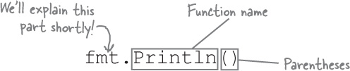
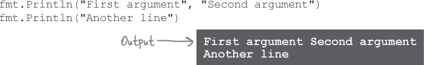
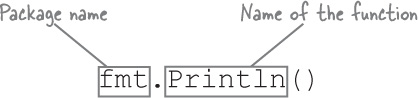
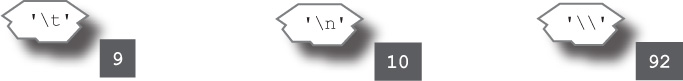

# Chapter 1. let’s get going: Syntax Basics

## Ready, set, Go!

Back in 2007, the search engine Google had a problem. They had to maintain programs with millions of lines of code. Before they could test new changes, they had to compile the code into a runnable form, a process which at the time took the better part of an hour. Needless to say, this was bad for developer productivity.

So Google engineers Robert Griesemer, Rob Pike, and Ken Thompson sketched out some goals for a new language:

- Fast compilation
- Less cumbersome code
- Unused memory freed automatically (garbage collection)
- Easy-to-write software that does several operations simultaneously (concurrency)
- Good support for processors with multiple cores

After a couple years of work, Google had created Go: a language that was fast to write code for and produced programs that were fast to compile and run. The project switched to an open source license in 2009. It’s now free for anyone to use. And you should use it! Go is rapidly gaining popularity thanks to its simplicity and power.

If you’re writing a command-line tool, Go can produce executable files for Windows, macOS, and Linux, all from the same source code. If you’re writing a web server, it can help you handle many users connecting at once. And no matter what you’re writing, it will help you ensure that your code is easier to maintain and add to.

Ready to learn more? Let’s Go!

## The Go Playground

The easiest way to try Go is to visit https://play.golang.org in your web browser. There, the Go team has set up a simple editor where you can enter Go code and run it on their servers. The result is displayed right there in your browser.


(Of course, this only works if you have a stable internet connection. If you don’t, see [“Installing Go on your computer”](https://golang.org/doc/install#install) to learn how to download and run the Go compiler directly on your computer. Then run the following examples using the compiler instead.)

### Let’s try it out now!


1. Open https://play.golang.org in your browser. (Don’t worry if what you see doesn’t quite match the screenshot; it just means they’ve improved the site since this book was printed!)

2. Delete any code that’s in the editing area, and type this instead:

```go
    package main
    import "fmt"
    func main() {
        fmt.Println("Hello, Go!")
    }
```

> NOTE - Don’t worry, we’ll explain what all this means on the next page!

3. Click the Format button, which will automatically reformat your code according to Go conventions.

4. Click the Run button.

You should see “Hello, Go!” displayed at the bottom of the screen. Congratulations, you’ve just run your first Go program!


## What does it all mean?

You’ve just run your first Go program! Now let’s look at the code and figure out what it actually means...

Every Go file starts with a package clause. A **package** is a collection of code that all does similar things, like formatting strings or drawing images. The package clause gives the name of the package that this file’s code will become a part of. In this case, we use the special package main, which is required if this code is going to be run directly (usually from the terminal).

Next, Go files almost always have one or more import statements. Each file needs to **import** other packages before its code can use the code those other packages contain. Loading all the Go code on your computer at once would result in a big, slow program, so instead you specify only the packages you need by importing them.


The last part of every Go file is the actual code, which is often split up into one or more functions. A function is a group of one or more lines of code that you can call (run) from other places in your program. When a Go program is run, it looks for a function named main and runs that first, which is why we named this function `main`.

**Don’t worry if you don’t understand all this right now!**
We’ll look at everything in more detail in the next few pages.

## The typical Go file layout

You’ll quickly get used to seeing these three sections, in this order, in almost every Go file you work with:

1. The package clause
2. Any import statements
3. The actual code
   

The saying goes, “a place for everything, and everything in its place.” Go is a very _consistent_ language. This is a good thing: you’ll often find you just _know_ where to look in your project for a given piece of code, without having to think about it!

## there are no Dumb Questions

**Q: My other programming language requires that each statement end with a semicolon. Doesn’t Go?**

**A:** You can use semicolons to separate statements in Go, but it’s not required (in fact, it’s generally frowned upon).

**Q: What’s this Format button? Why did we click that before running our code?**

**A:** The Go compiler comes with a standard formatting tool, called go fmt. The Format button is the web version of go fmt.

Whenever you share your code, other Go developers will expect it to be in the standard Go format. That means that things like indentation and spacing will be formatted in a standard way, making it easier for everyone to read. Where other languages achieve this by relying on people manually reformatting their code to conform to a style guide, with Go all you have to do is run go fmt, and it will automatically fix everything for you.

We ran the formatter on every example we created for this book, and you should run it on all your code, too!

## What if something goes wrong?

Go programs have to follow certain rules to avoid confusing the compiler. If we break one of these rules, we’ll get an error message.

Suppose we forgot to add parentheses on our call to the Println function on line 6.

If we try to run this version of the program, we get an error: f0005-01


Go tells us which source code file and line number we need to go to so we can fix the problem. (The Go Playground saves your code to a temporary file before running it, which is where the _prog.go_ filename comes from.) Then it gives a description of the error. In this case, because we deleted the parentheses, Go can’t tell we’re trying to call the Println function, so it can’t understand why we’re putting "Hello, Go" at the end of line 6.

## Breaking Stuff is Educational!


We can get a feel for the rules Go programs have to follow by intentionally breaking our program in various ways. Take this code sample, try making one of the changes below, and run it. Then undo your change and try the next one. See what happens!

```go
    package main
    import "fmt"
    func main() {
        fmt.Println("Hello, Go!")}
```

> NOTE - Try breaking our code sample and see what happens!

| If you do this...                                                       | ...it will fail because...                                                                                  |
| ----------------------------------------------------------------------- | ----------------------------------------------------------------------------------------------------------- |
| Delete the package clause... ~~package main~~                           | Every Go file has to begin with a package clause.                                                           |
| Delete the import statement... ~~import "fmt"~~                         | Every Go file has to import every package it references.                                                    |
| Import a second (unused) package... ~~import "fmt" import "strings"~~   | Go files must import only the packages they reference. (This helps keep your code compiling fast!)          |
| Rename the main function... func ~~main~~hello                          | Go looks for a function named main to run first.                                                            |
| Change the Println call to lowercase... fmt.Pprintln("Hello, Go!")      | Everything in Go is case-sensitive, so although fmt.Println is valid, there’s no such thing as fmt.println. |
| Delete the package name before Println... ~~fmt~~.Println("Hello, Go!") | The Println function isn’t part of the main package, so Go needs the package name before the function call. |

Let’s try the first one as an example...


## Calling functions

Our example includes a call to the fmt package’s Println function. To call a function, type the function name (Println in this case), and a pair of parentheses.




Like many functions, Println can take one or more arguments: values you want the function to work with. The arguments appear in parentheses after the function name.


Println can be called with no arguments, or you can provide several arguments. When we look at other functions later, however, you’ll find that most require a specific number of arguments. If you provide too few or too many, you’ll get an error message saying how many arguments were expected, and you’ll need to fix your code.

## The Println function

Use the Println function when you need to see what your program is doing. Any arguments you pass to it will be printed (displayed) in your terminal, with each argument separated by a space.

After printing all its arguments, Println will skip to a new terminal line. (That’s why “ln” is at the end of its name.)



## Using functions from other packages

The code in our first program is all part of the main package, but the Println function is in the fmt package. (The fmt stands for “format.”) To be able to call Println, we first have to import the package containing it.


Once we’ve imported the package, we can access any functions it offers by typing the package name, a dot, and the name of the function we want.



Here’s a code sample that calls functions from a couple other packages. Because we need to import multiple packages, we switch to an alternate format for the import statement that lets you list multiple packages within parentheses, one package name per line.


Once we’ve imported the math and strings packages, we can access the math package’s Floor function with math.Floor, and the strings package’s Title function with strings.Title.

You may have noticed that in spite of including those two function calls in our code, the above sample doesn’t display any output. We’ll look at how to fix that next.

## Function return values

In our previous code sample, we tried calling the math.Floor and strings.Title functions, but they didn’t produce any output:

```go
    package main
    import (
        "math"
        "strings"
    )
    func main() {
        math.Floor(2.75)
        strings.Title("head first go")
    }
```

> NOTE - This program produces no output!

When we call the `fmt.Println` function, we don’t need to communicate with it any further after that. We pass one or more values for `Println` to print, and we trust that it printed them. But sometimes a program needs to be able to call a function and get data back from it. For this reason, functions in most programming languages can have **return values**: a value that the function computes and returns to its caller.

The `math.Floor` and `strings.Title` functions are both examples of functions that use return values. The `math.Floor` function takes a floating-point number, rounds it down to the nearest whole number, and returns that whole number. And the `strings.Title` function takes a string, capitalizes the first letter of each word it contains (converting it to “title case”), and returns the capitalized string.

To actually see the results of these function calls, we need to take their return values and pass those to `fmt.Println`:


Once this change is made, the return values get printed, and we can see the results.

## Strings

We’ve been passing **strings** as arguments to Println. A string is a series of bytes that usually represent text characters. You can define strings directly within your code using **string literals**: text between double quotation marks that Go will treat as a string.


Within strings, characters like newlines, tabs, and other characters that would be hard to include in program code can be represented with escape sequences: a backslash followed by characters that represent another character.


| Escape sequence | Value                   |
| --------------- | ----------------------- |
| \n              | A newline character.    |
| \t              | A tab character.        |
| \"              | Double quotation marks. |
| \\              | A backslash.            |

## Runes

Whereas strings are usually used to represent a whole series of text characters, Go’s runes are used to represent single characters.


String literals are written surrounded by double quotation marks ("), but **rune literals** are written with single quotation marks (').

Go programs can use almost any character from almost any language on earth, because Go uses the Unicode standard for storing runes. Runes are kept as numeric codes, not the characters themselves, and if you pass a rune to fmt.Println, you’ll see that numeric code in the output, not the original character.


Just as with string literals, escape sequences can be used in a rune literal to represent characters that would be hard to include in program code:



## Booleans

Boolean values can be one of only two values: `true` or `false`. They’re especially useful with conditional statements, which cause sections of code to run only if a condition is true or false. (We’ll look at conditionals in the next chapter.)


## Numbers

You can also define numbers directly within your code, and it’s even simpler than string literals: just type the number.


As we’ll see shortly, Go treats integer and floating-point numbers as different types, so remember that a decimal point can be used to distinguish an integer from a floating-point number.

## Math operations and comparisons

Go’s basic math operators work just like they do in most other languages. The + symbol is for addition, - for subtraction, \* for multiplication, and / for division.


You can use < and > to compare two values and see if one is less than or greater than another. You can use == (that’s two equals signs) to see if two values are equal, and != (that’s an exclamation point and an equals sign, read aloud as “not equal”) to see if two values are not equal. <= tests whether the first value is less than or equal to the second, and >= tests whether the first value is greater than or equal to the second.

The result of a comparison is a Boolean value, either `true` or `false`.


## Types

In a previous code sample, we saw the `math.Floor` function, which rounds a floating-point number down to the nearest whole number, and the `strings.Title` function, which converts a string to title case. It makes sense that you would pass a number as an argument to the `Floor` function, and a string as an argument to the `Title` function. But what would happen if you passed a string to Floor and a number to `Title`?


Go prints two error messages, one for each function call, and the program doesn’t even run!

Things in the world around you can often be classified into different types based on what they can be used for. You don’t eat a car or truck for breakfast (because they’re vehicles), and you don’t drive an omelet or bowl of cereal to work (because they’re breakfast foods).

Likewise, values in Go are all classified into different **types**, which specify what the values can be used for. Integers can be used in math operations, but strings can’t. Strings can be capitalized, but numbers can’t. And so on.

Go is **statically typed**, which means that it knows what the types of your values are even before your program runs. Functions expect their arguments to be of particular types, and their return values have types as well (which may or may not be the same as the argument types). If you accidentally use the wrong type of value in the wrong place, Go will give you an error message. This is a good thing: it lets you find out there’s a problem before your users do!

> Go is statically typed. If you use the wrong type of value in the wrong place, Go will let you know.

You can view the type of any value by passing it to the reflect package’s TypeOf function. Let’s find out what the types are for some of the values we’ve already seen:


Here’s what those types are used for:

| Type    | Description                                                                                                                                                                                                                                          |
| ------- | ---------------------------------------------------------------------------------------------------------------------------------------------------------------------------------------------------------------------------------------------------- |
| int     | An integer. Holds whole numbers.                                                                                                                                                                                                                     |
| float64 | A floating-point number. Holds numbers with a fractional part. (The 64 in the type name is because 64 bits of data are used to hold the number. This means that float64 values can be fairly, but not infinitely, precise before being rounded off.) |
| bool    | A Boolean value. Can only be true or false.                                                                                                                                                                                                          |
| string  | A string. A series of data that usually represents text characters.                                                                                                                                                                                  |
